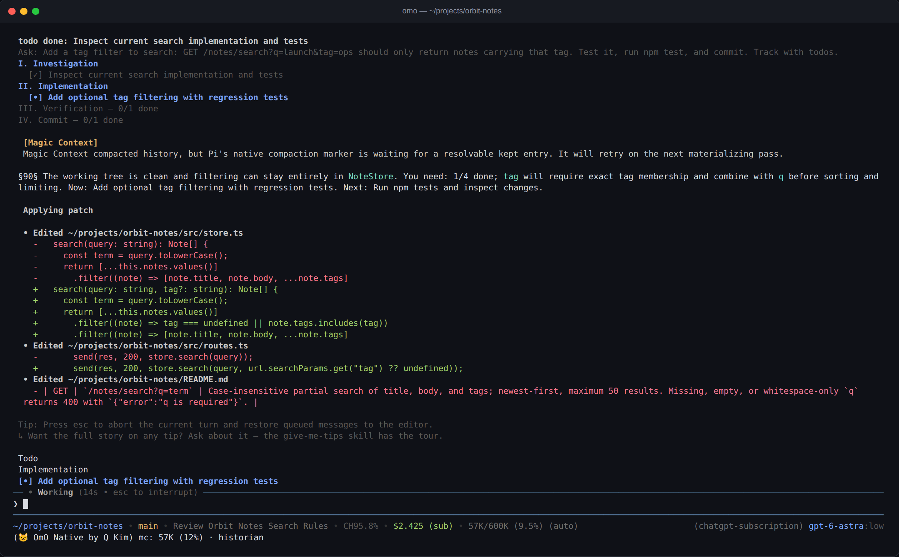
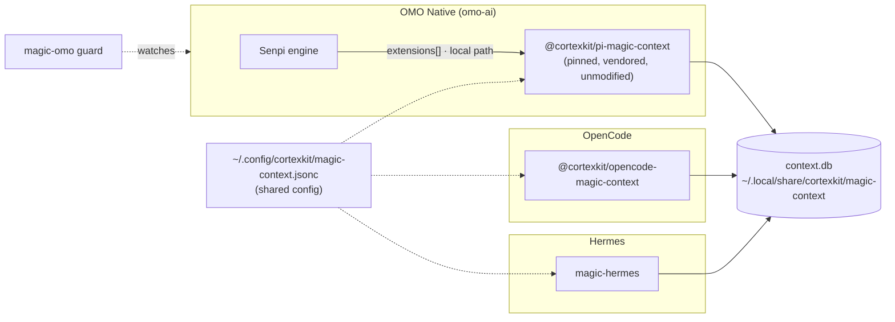
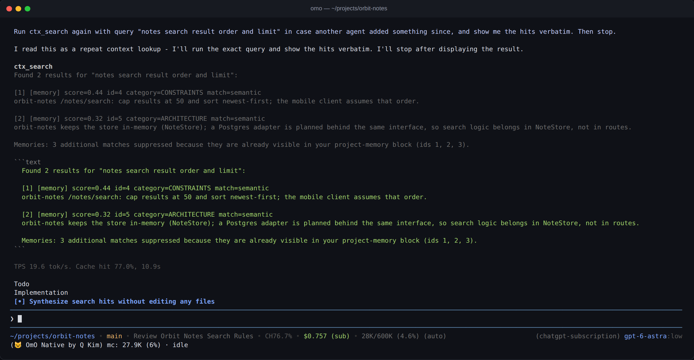
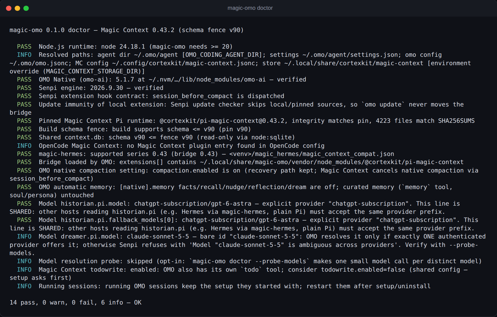

<div align="center">

# magic-omo

**The best harness, with a memory that never forgets. One brain shared by OMO, OpenCode and Hermes.**

Run [Magic Context](https://github.com/cortexkit/magic-context) inside [OMO Native](https://github.com/code-yeongyu/oh-my-openagent)
(the Senpi-based `omo` CLI). It shares the *same* `context.db` your other agents already use, so memories, notes and compartments carry over between them.

[](https://github.com/Jonathannkayy/magic-omo/actions/workflows/ci.yml)
[](LICENSE)
[](package.json)
[](docs/COMPATIBILITY.md)
[](https://github.com/cortexkit/magic-context)

[Why not just `omo install`?](#why-not-just-omo-install-it) · [Quick start](#quick-start) · [What setup changes](#what-setup-changes) · [Doctor](#doctor) · [Compatibility](#compatibility) · [FAQ](#faq) · [Credits](#credits--thanks)


<!-- hero.png: real OMO Native 5.1.7 TUI session on a fictional demo project with a fresh, empty Magic Context store. How it was made: docs/assets/README.md -->

</div>

## Two of the best tools in agentic coding, finally together

<table>
<tr>
<td width="50%" valign="top">

### 😺 OMO Native
**by [Q (Yeongyu Kim)](https://github.com/code-yeongyu)**

The harness that made "just let the agent cook" a real workflow. [oh-my-openagent](https://github.com/code-yeongyu/oh-my-openagent) turns one model into a team:

- **Specialist agents** for exploration, planning, architecture, implementation and review, each routed to the model that's best at it
- **`ulw-plan` → `ulw-execute`**: adversarial planning, then evidence-driven execution that doesn't stop at "looks done"
- **`review-work`** and **`hyperplan`**: multi-angle reviews and five-member cross-critique before anything ships
- **19 built-in skills**, background agents, LSP, AST-grep, and a Senpi engine built for long, unattended runs

</td>
<td width="50%" valign="top">

### 🧠 Magic Context
**by [Ufuk Altinok / CortexKit](https://github.com/cortexkit/magic-context)**

*"Unbounded context. Memory that manages itself. One session, for life."* The hippocampus for coding agents:

- **No context wall**: a background historian folds old turns into searchable compartments while you keep working
- **Durable project memory**, notes and smart notes that resurface exactly when they matter
- **A dreamer** that consolidates, verifies and curates memory overnight
- **One store for every harness**: OpenCode, Pi and Hermes already share it

</td>
</tr>
</table>

**magic-omo is the missing link.** It loads Magic Context's official runtime, unmodified, into OMO Native, so OMO's specialist agents get Magic Context's memory, and every memory OMO makes is instantly there in OpenCode and Hermes too. All credit for the hard parts goes to Q and Ufuk; this project just makes them talk.

## Why

Magic Context gives coding agents managed context with no hard wall: background compaction into a searchable history, durable project memory, notes, and a dreamer. OpenCode and Hermes can already share one Magic Context store. OMO Native can load Pi extensions, but making Magic Context work there safely has a few traps:

- **Two context managers would fight, but OMO's cannot simply be switched off.** Magic Context owns the window; OMO's `compaction.enabled` must nevertheless stay **on** (see [why](#why-native-compaction-stays-on)).
- **Two automatic memory systems duplicate context.** OMO's own facts, recall, nudge, reflection and dream subsystems inject memory next to Magic Context's.
- **Historian models silently fail to resolve** (see [gotchas](#historian-model-gotchas)).
- **Mixed versions on one DB break everyone.** Every process that shares `context.db` must run the same Magic Context series.

`magic-omo` handles each of these for you, makes every change reversible, and re-checks the setup whenever OMO or the pinned extension changes.

## Why not just `omo install` it?

You can. Magic Context's Pi runtime loads in OMO Native with a plain `omo install`, and magic-omo installs that exact same runtime, unmodified. What magic-omo adds is the setup around it:

- **One automatic memory, not two.** OMO's automatic memory (`facts`, `recall`, `nudge`, `reflection`, `dream`) is on by default, so a plain install runs two memory injectors side by side. Magic Context's own OMP setup turns the host's automatic memory off for the same reason ("a second memory injector duplicates recall and retention"). magic-omo switches off only those five keys; OMO's curated memory (the `memory` tool, soul) is untouched. Keep both with `--keep-omo-memory`.
- **No version drift.** `omo update` updates every extension that is not local or pinned. If OpenCode or Hermes share the same `context.db`, a newer Magic Context migrates the database forward and the older hosts refuse to open it. magic-omo pins the series your other hosts already run as a local path, so `omo update` cannot move it, and checks new upstream releases daily.
- **A historian model that resolves on OMO.** If the historian model is not usable on OMO, compaction stalls on it. `magic-omo doctor --probe-models` checks the model before you find out mid-session.
- **Compaction that can't deadlock.** Upstream's OMP steps turn native compaction off. On OMO Native that stops sessions that outgrew the window from resuming, so magic-omo leaves it on and lets Magic Context cancel it ([details](#why-native-compaction-stays-on)).

If you only run OMO Native and nothing else touches the database, a plain install is mostly fine; `npx magic-omo doctor` is still a quick health check.

## How it fits together



## Quick start

```bash
npx magic-omo setup      # interactive: shows every change, asks before applying
npx magic-omo doctor     # PASS / WARN / FAIL / INFO
# restart your OMO sessions (running sessions keep their old setup)
```

Requirements: Node.js ≥ 20, OMO Native, and `npm`, which is used once to fetch the pinned runtime. Useful flags: `--dry-run` writes nothing. `--yes` runs non-interactively. `--keep-omo-memory` leaves OMO's automatic memory on. `--todowrite` / `--no-todowrite` decide the shared-config question up front. `--mc <version>` pins a specific Magic Context version instead of the one setup picks, and `--prune` deletes the vendored runtimes you no longer use.

## Always compatible

Magic Context moves fast, and every process that shares one `context.db` has to move together. magic-omo is built so that is never your problem:

- **Several Magic Context versions, side by side.** magic-omo ships a pinned, lockfile-integrity-checked runtime for each supported series, each in its own vendored tree. Which OMO combinations are end-to-end verified is spelled out in the compatibility table below. Nothing is downloaded twice, and switching back is instant.
- **Setup picks the version your machine already runs.** Before touching anything, setup reads the Magic Context plugin OpenCode loads, the series magic-hermes declares, and the schema version of the shared database, then installs the pin that matches them. It never silently jumps to a newer series — a newer build migrates the shared database forward and would lock your other hosts out. If your hosts disagree with each other, setup refuses and tells you exactly who runs what.
- **Upstream is checked every day.** A scheduled contract check re-verifies, statically and without a single model call, that Senpi still dispatches `session_before_compact`, still skips local and pinned sources so `omo update` cannot move the bridge, that OMO still honours the agent-dir environment variables and the `[native].memory` keys magic-omo switches off, and that the Magic Context build still loads as a Pi extension with the schema fence we recorded.
- **New upstream releases are tested end to end before they are pinned.** The maintainer bot runs the real sandbox — isolated home, isolated store, a snapshot of the database — against the new combination, and only then marks the row verified, updates the compatibility table and ships a release.
- **`doctor` knows every verified combination.** It tells you which pin was selected and why, lists all supported pins, and flags any combination that is not verified yet (WARN, or FAIL with `--strict`).

```bash
magic-omo pins            # every supported Magic Context version and its verified combinations
magic-omo setup --mc 0.44.4   # override the choice
```

## What setup changes

Every row is backed up first. Each file is written atomically (temp file plus rename, file mode preserved), recorded in an install record, and reverted by `magic-omo uninstall`.

| File | Change | Why | Default |
|---|---|---|---|
| `~/.local/share/magic-omo/vendor/<version>/` | `npm install --ignore-scripts --save-exact @cortexkit/pi-magic-context@<selected pin>`, integrity checked against the pin, then frozen with `SHA256SUMS` | Same bytes on every machine; nothing global. Each supported version gets its own tree, so switching series never re-downloads | always |
| `$OMO_AGENT_DIR/settings.json` | append the **absolute local path** of the pinned package to `extensions[]` | Senpi's update checker skips `local` and pinned sources, so `omo update` never moves it | always |
| `$OMO_AGENT_DIR/settings.json` | **nothing else** — `compaction.enabled` is deliberately left as it is | OMO needs its own compaction flag on to recover an oversized resumed session; Magic Context still cancels every native compaction ([why](#why-native-compaction-stays-on)) | never changed |
| `~/.omo/omo.jsonc` | `"[native]".memory.{facts,recall,nudge,reflection,dream}.enabled = false`, merged in with comments preserved | One automatic memory injector, not two | on (`--keep-omo-memory` to skip) |
| `~/.config/cortexkit/magic-context.jsonc` | `todowrite.enabled = false` | OMO ships its own `todo` tool | **asked**, because this file is shared with every host |

`$OMO_AGENT_DIR` resolves to the first of `OMO_CODING_AGENT_DIR`, `SENPI_CODING_AGENT_DIR`, `PI_CODING_AGENT_DIR`, falling back to `~/.omo/agent`, exactly as `omo` resolves it. If `settings.jsonc` exists, it is the file edited.

## Memory split

| Concern | Owner after setup | Notes |
|---|---|---|
| Context window / compaction | **Magic Context** | OMO's `compaction.enabled` stays on as a safety net; MC cancels native compaction on every turn ([why](#why-native-compaction-stays-on)) |
| Automatic memory (facts extraction, recall sidecar, nudges, reflection, dream) | **Magic Context** | OMO `[native].memory.<x>.enabled=false`. Verified in a sandbox: OMO wrote no facts-queue, recall or reflection files |
| Curated memory: explicit `memory` tool, soul/persona | **OMO** (unchanged) | An explicit "remember X" still commits to OMO's memory repo |
| `memory.enabled`, search, sync | **OMO** (unchanged) | Never touched |
| Task list | **OMO `todo`** | MC `todowrite` off, only if you agree |
| Cross-agent search (`ctx_search`, `ctx_memory`, notes) | **Magic Context** | Shared with OpenCode and Hermes through `context.db` |


<!-- ctx-search.png: memories id=4 and id=5 were written by the Hermes Magic Context runtime (ctx_memory over its JSON-RPC bridge) into the demo store, then found by OMO's ctx_search. How it was made: docs/assets/README.md -->

## Why native compaction stays on

Upstream's OMP setup disables the host's native compaction (`compaction.enabled=false`), and
that is the right call there. On OMO Native it creates a **resume deadlock**, so `magic-omo`
deliberately leaves the flag alone.

Senpi admits a session by projecting the *stored transcript* against the model window
(`projectModelUsabilityBudget`). Reopening a session that grew past the window raises:

```
ModelUsabilityBudgetError: Model "anthropic-subscription/claude-haiku-4-5" cannot resume:
target context window 200000 tokens is 4683 tokens short of the 204683-token requirement
(live context 101934, system prompt 8283, active tool schemas 14082, output reserve 64000,
 compaction reserve 0, speculation lead 0, safety margin 16384 [anthropic]).
```

The recovery path for that error — slice the transcript and continue — is gated on the host's
own compaction flag (`sdk.js`: `!session.settingsManager.getCompactionEnabled()` rethrows).
Turn the flag off and the session refuses **every** turn, permanently. Magic Context's own
reclaim does not help: it shrinks what is *sent*, while the admission check reads what is
*stored*.

Leaving it on costs nothing, because Magic Context still owns the window: its
`session_before_compact` handler cancels native compaction (`session_before_compact:
cancelling — magic-context owns compaction`).

Verified in an isolated sandbox on a 200K-window model, with Magic Context loaded and the
flag on: 14 consecutive turns of tool-read + long-analysis work, usage held between 47% and
68% while Magic Context published **6 compartments**, and every `compaction` entry written to
the session came from Magic Context's own marker (`fromHook: true`, summary prefixed
`Magic Context compacted:`) — OMO's native compactor never ran. A second run of 18 turns of
~28 KB pasted notes each climbed to **96.0%** before Magic Context's `force_band` historian
fired. With the flag off, the same workload wedged and every later turn failed with
`ModelUsabilityBudgetError`.

## Historian model gotchas

The historian and dreamer run as OMO subagents and use the `historian.pi` / `dreamer.pi` lines of the shared config. This is the most common reason "Magic Context loads but never compacts":

1. **`google/…` and `openai/…` get rewritten.** For Pi subagents, Magic Context rewrites `google/x` to `google-antigravity/x` and `openai/x` to `openai-codex/x`. OMO Native has neither provider, so the subagent fails with:
   ```
   Model "google-antigravity/gemini-3.1-pro-preview" not found
   ```
   `doctor` reports this as **FAIL** without calling anything.
2. **Bare ids can be ambiguous.** If more than one *authenticated* OMO provider offers the id, Senpi refuses with:
   ```
   Model "claude-sonnet-5-5" is ambiguous across providers: anthropic, anthropic-subscription. More than one matching provider is authenticated. Use --provider or provider/model.
   ```
   You can fix this in two ways. One is to authenticate only one provider that offers the id, for example by removing a dead or unused key. The other is to use an OMO-native prefix such as `anthropic-subscription/claude-sonnet-5-5`. **The line is shared**, so every other host that reads `historian.pi` (for example Hermes through magic-hermes) must accept the same prefix.
3. **Never set the harness to `omp`.** In omp mode Magic Context passes `--no-rules`, and Senpi rejects it with `Unknown option: --no-rules`.

`magic-omo doctor --probe-models` asks OMO to resolve each model in exactly the shape the historian uses. This makes **one small real model call per distinct model**. OMO caches provider availability, so a single "ambiguous" result is reported as WARN; retry once before acting on it.

## Doctor


<!-- doctor.png: `magic-omo doctor` right after `magic-omo setup --yes` in a throwaway HOME. How it was made: docs/assets/README.md -->

Example output (illustrative; paths shortened):

```text
magic-omo 0.1.0 doctor — Magic Context 0.43.2 (schema fence v90)

  PASS  Node.js runtime: node 22.22.2 (magic-omo needs >= 20)
  INFO  Resolved paths: agent dir ~/.omo/agent [default ($HOME/.omo/agent)]; …
  PASS  OMO Native (omo-ai): 5.1.7 at ~/.nvm/…/omo-ai — verified
  PASS  Senpi engine: 2026.9.30 — verified
  PASS  Senpi extension hook contract: session_before_compact is dispatched
  PASS  Update immunity of local extension: Senpi update checker skips local/pinned sources, so `omo update` never moves the bridge
  PASS  Magic Context pin: Magic Context 0.43.2 — matches OpenCode + magic-hermes (series 0.43)
  INFO  Supported Magic Context pins: 0.44.4 (fence v91, 0 verified row(s)); 0.43.2 (fence v90, 1 verified row(s)); default 0.43.2
  PASS  Pinned Magic Context Pi runtime: @cortexkit/pi-magic-context@0.43.2, integrity matches pin, 4223 files match SHA256SUMS
  PASS  Build schema fence: build supports schema <= v90 (pin v90)
  PASS  Shared context.db: schema v90 <= fence v90 (read-only via node:sqlite)
  PASS  OpenCode Magic Context: 0.43.2 via package.json (@cortexkit/opencode-magic-context) (bridge 0.43.2)
  PASS  magic-hermes: supported series 0.43 (bridge 0.43)
  PASS  Bridge loaded by OMO: extensions[] contains ~/.local/share/magic-omo/vendor/0.43.2/node_modules/@cortexkit/pi-magic-context
  PASS  OMO native compaction setting: compaction.enabled is on (recovery path kept; Magic Context cancels native compaction via session_before_compact)
  PASS  OMO automatic memory: [native].memory facts/recall/nudge/reflection/dream are off; curated memory untouched
  INFO  Model historian.pi.model: claude-sonnet-5-5 — bare id …; verify with --probe-models
  PASS  Magic Context todowrite: disabled (OMO ships its own `todo` tool)
  INFO  Running sessions: running OMO sessions keep the setup they started with; restart them after setup/uninstall
```

`doctor --json` returns machine-readable output and exits nonzero on any FAIL. `doctor --quiet` prints only the summary line, for scripts, and keeps the same exit code; `--json` takes precedence if both are given. `--strict` turns unverified OMO/Senpi versions into FAIL.

## Compatibility

<!-- BEGIN GENERATED: compat (npm run compat:gen) -->
| Magic Context | Schema fence | Lockfile | npm integrity | Verified combinations |
|---|---|---|---|---|
| `0.44.4` | `v91` | [`vendor/0.44.4/package-lock.json`](vendor/0.44.4/package-lock.json) | `sha512-MHCWA3xDgSqxSbR7QJzgJT23LmlznOCmYg0miDGfnmxGE7nqq1TYoOif1KGDF9LXPfvOYf9fcXg1goB6o2I83g==` | omo-ai 5.1.13 / senpi 2026.10.3, omo-ai 5.1.12 / senpi 2026.10.2, omo-ai 5.1.11 / senpi 2026.10.1-3, omo-ai 5.1.10 / senpi 2026.10.1-3, omo-ai 5.1.9 / senpi 2026.10.1-3 |
| `0.43.2` **(default)** | `v90` | [`vendor/0.43.2/package-lock.json`](vendor/0.43.2/package-lock.json) | `sha512-9l/OpJXgj/Uavz3JQXhJEE4BMxgg/iv96JWCjW8jeP2MxuPJgfVggdmgEHBD1m3aV22nxYaYbMaAvy8HqYhrDw==` | omo-ai 5.1.13 / senpi 2026.10.3, omo-ai 5.1.12 / senpi 2026.10.2, omo-ai 5.1.11 / senpi 2026.10.1-3, omo-ai 5.1.10 / senpi 2026.10.1-3, omo-ai 5.1.9 / senpi 2026.10.1-3, omo-ai 5.1.7 / senpi 2026.9.30 |

<details>
<summary>Full verification matrix</summary>

| Magic Context | Schema fence | OMO Native (`omo-ai`) | Senpi | Status | Verified | Evidence | Notes |
|---|---|---|---|---|---|---|---|
| **0.44.4** | v91 | `5.1.13` | `2026.10.3` | ✅ verified | 2026-10-03 | compat_e2e 2026-10-03: {"loaded":true,"tools":true,"no_fail_closed":true,"write_landed":true,"search_found":true} | Auto-verified end to end in an isolated OMO Native session: loaded, tools, no_fail_closed, write_landed, search_found. |
|  |  | `5.1.12` | `2026.10.2` | ✅ verified | 2026-10-03 | compat_e2e 2026-10-03: {"loaded":true,"tools":true,"no_fail_closed":true,"write_landed":true,"search_found":true} | Auto-verified end to end in an isolated OMO Native session: loaded, tools, no_fail_closed, write_landed, search_found. |
|  |  | `5.1.11` | `2026.10.1-3` | ✅ verified | 2026-10-02 | compat_e2e 2026-10-02: {"loaded":true,"tools":true,"no_fail_closed":true,"write_landed":true,"search_found":true} | Auto-verified end to end in an isolated OMO Native session: loaded, tools, no_fail_closed, write_landed, search_found. |
|  |  | `5.1.10` | `2026.10.1-3` | ✅ verified | 2026-10-02 | compat_e2e 2026-10-02: {"loaded":true,"tools":true,"no_fail_closed":true,"write_landed":true,"search_found":true} | Auto-verified end to end in an isolated OMO Native session: loaded, tools, no_fail_closed, write_landed, search_found. |
|  |  | `5.1.9` | `2026.10.1-3` | ✅ verified | 2026-10-02 | compat_e2e 2026-10-02: {"loaded":true,"tools":true,"no_fail_closed":true,"write_landed":true,"search_found":true} | Auto-verified end to end in an isolated OMO Native session: loaded, tools, no_fail_closed, write_landed, search_found. |
|  |  | `5.1.8` | `2026.10.1-2` | ⚠️ unverified | — | — | Pinned; lockfile integrity matches npm. Awaiting the end-to-end sandbox run. |
|  |  | `5.1.7` | `2026.9.30` | ⚠️ unverified | — | — | Pinned; lockfile integrity matches npm. Awaiting the end-to-end sandbox run. |
| **0.43.2** **(default)** | v90 | `5.1.13` | `2026.10.3` | ✅ verified | 2026-10-03 | compat_e2e 2026-10-03: {"loaded":true,"tools":true,"no_fail_closed":true,"write_landed":true,"search_found":true} | Auto-verified end to end in an isolated OMO Native session: loaded, tools, no_fail_closed, write_landed, search_found. |
|  |  | `5.1.12` | `2026.10.2` | ✅ verified | 2026-10-03 | compat_e2e 2026-10-03: {"loaded":true,"tools":true,"no_fail_closed":true,"write_landed":true,"search_found":true} | Auto-verified end to end in an isolated OMO Native session: loaded, tools, no_fail_closed, write_landed, search_found. |
|  |  | `5.1.11` | `2026.10.1-3` | ✅ verified | 2026-10-02 | compat_e2e 2026-10-02: {"loaded":true,"tools":true,"no_fail_closed":true,"write_landed":true,"search_found":true} | Auto-verified end to end in an isolated OMO Native session: loaded, tools, no_fail_closed, write_landed, search_found. |
|  |  | `5.1.10` | `2026.10.1-3` | ✅ verified | 2026-10-02 | compat_e2e 2026-10-02: {"loaded":true,"tools":true,"no_fail_closed":true,"write_landed":true,"search_found":true} | Auto-verified end to end in an isolated OMO Native session: loaded, tools, no_fail_closed, write_landed, search_found. |
|  |  | `5.1.9` | `2026.10.1-3` | ✅ verified | 2026-10-02 | compat_e2e 2026-10-02: {"loaded":true,"tools":true,"no_fail_closed":true,"write_landed":true,"search_found":true} | Auto-verified end to end in an isolated OMO Native session: loaded, tools, no_fail_closed, write_landed, search_found. |
|  |  | `5.1.8` | `2026.10.1-2` | ⚠️ unverified | — | — | Released after the last verification. Doctor reports WARN (FAIL with --strict) until re-verified. |
|  |  | `5.1.7` | `2026.9.30` | ✅ verified | 2026-10-01 | — | Sandbox-verified: extension loads (harness=pi), ctx_* tools registered, writes land in the configured store, historian published a compartment, [native].memory policy suppresses OMO automatic memory while explicit `memory` still commits. |

</details>
<!-- END GENERATED: compat -->

Full details are in [docs/COMPATIBILITY.md](docs/COMPATIBILITY.md), which is generated from [`compat.json`](compat.json).

**Same-series rule:** every process that shares `context.db` (OMO through magic-omo, OpenCode, Hermes, Pi) must run the same Magic Context `major.minor`. A DB schema newer than the selected build's fence fails closed, and a newer build migrates the database forward and locks older hosts out — which is why setup follows your other hosts rather than the newest release. `doctor` checks all of it.

## Guard (optional)

```bash
magic-omo guard install   # opt-in: systemd --user .path + .timer (Linux) or a launchd agent (macOS)
```

The guard re-runs every check whenever the omo-ai or Senpi `package.json`, the vendored extension, or the pin changes, plus once a day. If the bridge is live and a **hard** check fails, it uninstalls the bridge automatically and writes a loud message to stderr and `~/.local/share/magic-omo/guard.log`. When everything is healthy it stays silent. Remove it with `magic-omo guard uninstall`.

## Safety guarantees

- **Reversible.** Each change is recorded, and `uninstall` reverts exactly those changes. OMO rewrites `settings.json` all the time (`tipsHistory`, last model, …), so uninstall never restores whole files. A value you changed after setup is left as it is.
- **Comment-preserving.** `omo.jsonc` and `magic-context.jsonc` are edited with targeted text splices, so comments, ordering and trailing commas survive. Tests check that a setup/uninstall round-trip gives back byte-identical files.
- **Atomic, backed up, idempotent.** Writes go to a temp file that is then renamed, with the original file mode kept. A backup is taken before every write, and running setup twice changes nothing.
- **Read-only where it should be.** The shared DB is only ever opened read-only. `omo` is never executed unless you pass `--probe-models`.
- **Pinned.** The exact version and npm integrity are checked, every vendored file is hashed, and npm install scripts are disabled.
- **No foreign config changed silently.** The shared Magic Context config is only edited after you explicitly agree.

## Uninstall

```bash
magic-omo guard uninstall   # if you installed the guard
magic-omo uninstall         # reverts recorded changes; restart OMO sessions afterwards
rm -rf ~/.local/share/magic-omo   # optional: remove the vendored runtime, records and backups
```

## FAQ

**Does magic-omo change OMO itself?** No. In OMO's own files it only adds one path to `extensions[]` and flips five automatic-memory flags. With your consent it also sets `todowrite.enabled=false` in the shared Magic Context config. `magic-omo uninstall` reverts exactly those edits.


**Does `omo update` break or move the bridge?** No. The extension is a local path, and Senpi's update checker skips local and pinned sources. If OMO itself changes, the guard and doctor notice.

**Will my running OMO session pick it up?** No. Sessions keep the setup they started with, so restart them.

**Does this modify Magic Context?** No. It loads `@cortexkit/pi-magic-context` exactly as published.

**Where is my data?** In Magic Context's normal store (`MAGIC_CONTEXT_STORAGE_DIR`, else `$XDG_DATA_HOME/cortexkit/magic-context`, else `~/.local/share/cortexkit/magic-context`), shared with your other hosts.

**Why does OMO show up as harness `pi` in the DB?** OMO Native runs Magic Context's Pi runtime. That is intended, and rows written by OpenCode and Hermes stay attributed to them.

## Troubleshooting

| Symptom | Check |
|---|---|
| Magic Context never compacts | `doctor --probe-models`; see [historian gotchas](#historian-model-gotchas) |
| `schema vN is NEWER than this build's fence` | Another host upgraded Magic Context. Upgrade magic-omo to the same series (or pin the others back) |
| `OpenCode Magic Context … FAIL` | Mixed series on one DB. Align versions before using any of them |
| `Duplicate Magic Context loaders` | Remove the other `pi-magic-context` package or auto-discovered extension |
| Guard uninstalled the bridge | Read `~/.local/share/magic-omo/guard.log`, fix the cause, run `magic-omo setup` |

### End-to-end sandbox

`test/e2e/sandbox.sh` runs **real** OMO Native against a fully isolated HOME, agent dir, XDG directories, TMPDIR and a read-only snapshot of your DB. It refuses to start if any path resolves to your real `~/.omo` or live store. CI does not run it because it needs OMO credentials. See the header of the script.

## Contributing

Issues and pull requests are handled by Dante, an AI maintainer: every PR gets a full OMO Native `review-work` report, and issues are planned and fixed with `ulw-plan` → `ulw-execute`. The rules (and what the bot will never do) are in [MAINTAINER_BOT.md](MAINTAINER_BOT.md).

PRs are welcome. Read [CONTRIBUTING.md](CONTRIBUTING.md) first (fork + PR, tests required, conventional commits). Bugs in Magic Context or OMO themselves belong upstream; the [issue chooser](.github/ISSUE_TEMPLATE/config.yml) links there.

## Credits & thanks

This project is a small piece of glue between two excellent projects:

- **[Magic Context](https://github.com/cortexkit/magic-context)** by **Ufuk Altinok** ([cortexkit](https://github.com/cortexkit)), MIT. magic-omo downloads and loads its official Pi runtime unmodified. The setup and doctor patterns follow its OMP integration.
- **[oh-my-openagent / OMO Native](https://github.com/code-yeongyu/oh-my-openagent)** by **Yeongyu Kim** ([code-yeongyu](https://github.com/code-yeongyu)), MIT.
- **[Senpi](https://github.com/code-yeongyu/senpi)**, the engine under OMO Native (`package.json`: MIT, author Mario Zechner), descended from the Pi coding agent.

All trademarks and project names belong to their respective owners. See [THIRD_PARTY_NOTICES.md](THIRD_PARTY_NOTICES.md).

## License

[MIT](LICENSE) © 2026 Jonathan Khalil
